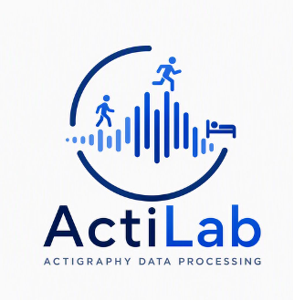

# ActiLab

A web application for importing actigraphy recordings, reviewing data quality, selecting transparent preprocessing and activity measures, classifying sleep/wake, calculating activity and light outcomes, and exporting reproducible results.

## User workflow

1. Importing Actigraphy Files
2. Initial QC
3. Estimating Activity Metric
4. Activity Preview
5. Cleaning and Masking
6. Sleep-wake Classification
7. Analysis Set-up
8. Other Sensors
9. Generate Results
10. Export Outputs

After an actigraphy file is uploaded, Steps 2–9 can be opened directly from the left workflow. Export unlocks after results are generated successfully.

## User documentation

Start with the [ActiLab user documentation](docs/README.md).

- [User guide](docs/USER_GUIDE.md)
- [Initial QC and data-quality settings](docs/PREPROCESSING_VALIDITY_RULES.md)
- [Supported file formats](docs/FILE_FORMATS.md)
- [Choosing an activity measure](docs/ACTIVITY_PROCESSING.md)
- [Metrics and algorithms](docs/METRICS_AND_ALGORITHMS.md)
- [Methods and reproducibility](docs/PREPROCESSING_AND_PROVENANCE.md)
- [Troubleshooting](docs/DIAGNOSTICS_AND_TROUBLESHOOTING.md)
- [Terms of use](docs/TERMS_OF_USE.md)
- [What’s new](docs/CHANGELOG.md)

## Recommended first analysis

- Use de-identified files.
- Review preprocessing QC, then keep the recommended Analysis settings in Step 7 unless the study protocol requires different criteria.
- Use the recommended source / processed acc activity measure unless a specific signal is required.
- Preview every recording before analysis.
- Review all warnings, missing metrics, valid-window decisions, and sleep-window exclusions.
- Save the exported configuration and quality-control information with the result tables.

## Scientific basis

The application uses pyActigraphy for native readers and downstream actigraphy methods. Raw accelerometer files are first converted to the selected epoch-level activity measure. Missing data, non-wear, and masks remain unavailable rather than being converted to zero activity.

See the [Methods and reproducibility guide](docs/PREPROCESSING_AND_PROVENANCE.md) for details.

## Contributions and code ownership

ActiLab accepts suggestions and pull requests, but proposed changes do not modify the protected production branch automatically. Repository protection should require maintainer/Code Owner approval before merge. See `CONTRIBUTING.md` and `GITHUB_PROTECTION_SETUP.md` at the repository root.

### Joined participant recordings with different native sampling rates

When files from the same participant were recorded at different native accelerometer sampling rates (for example 30 Hz and 100 Hz), ActiLab does not concatenate the raw samples. Each recording is processed independently at its native rate into the selected activity representation and the same analytical epoch (30 seconds for current raw GT3X/GENEActiv processing), then the epoch-level series are joined by timestamp. The original sampling rates are retained in participant-join provenance. ENMO and processed acceleration are allowed with an informational notice; MAD and PIM are allowed with a warning; ZCM is allowed with a strong warning because zero-crossing counts are sampling-frequency sensitive; source/device activity or ActiGraph counts are blocked across differing native rates unless they have been externally harmonized/validated. Different processed epoch intervals or different resolved activity bases/units remain incompatible.
